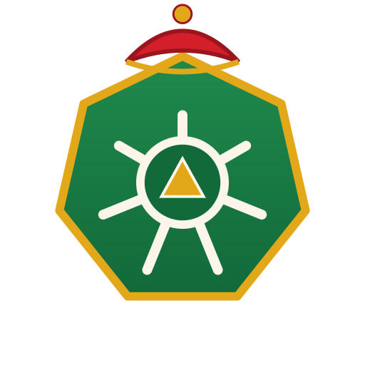
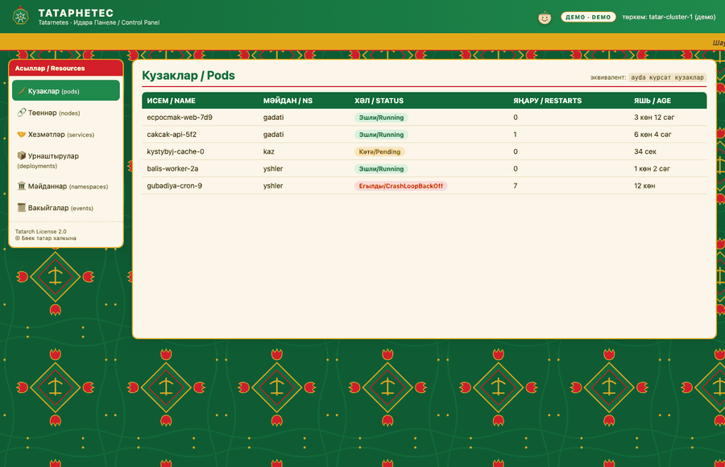

<div align="center">



# Татарнетес Идарә Панеле / Tatarnetes UI

**Милли идарә панеле · A national dashboard for Tatarnetes**

*Kubernetes Dashboard'ның татарча варианты — татар келәме фонында, түбәтәйле.*
*A Tatar edition of the Kubernetes Dashboard — on a carpet, in a skullcap.*

[](LICENSE)

[Татарча](#татарча) · [English](#english)



</div>

> Күренешләр: [дашборд](docs/media/dashboard.png) ·
> [төеннәр + тамга](docs/media/nodes-tamga.png) ·
> [чәй тәнәфесе + шамаиль](docs/media/tea-shamail.png) ·
> җанлы режим / live: [кузаклар](docs/media/live-pods.png) ·
> [вакыйгалар](docs/media/live-events.png) · [буш](docs/media/live-empty.png) ·
> [рөхсәт юк](docs/media/live-forbidden.png)

---

## Татарча

**Татарнетес Идарә Панеле** — Kubernetes Dashboard нигезендәге милли веб-панель.
Барлык интерфейс татарча: асыллар милли атамалар белән (кузаклар, төеннәр,
хезмәтләр, мәйданнар), фон — татар келәме, төсләр — Татарстан флагы (яшел-ак-кызыл)
плюс алтын. Өстә — түбәтәйле йөз: эш барса — шат, хата булса — ачулы.

### Үзенчәлекләр

- 🟢 Татар палитрасы + келәм фоны (`assets/carpet.svg`)
- 🥟 Тукай юллары һәм ризыклар йөгерүче тасмада
- 😊 Түбәтәйле йөз: шат / ачулы / чәй
- 🍵 **Чәй тәнәфесе** — консоль (`ayda`) белән бер үк график; тәнәфестә панель
  ябыла һәм кыстыбый-чәй экраны чыга
- 📊 Ике режим: **демо** (ялган мәгълүмат, гадәттә) һәм **җанлы** — чын кластер
  `kubectl proxy` аша (кузаклар, төеннәр, хезмәтләр, урнаштырулар, мәйданнар,
  вакыйгалар)

### Җибәрү — демо

```bash
git clone https://github.com/tatar-ncf/tatarnetes-ui.git
cd tatarnetes-ui
python3 -m http.server 8080      # http://localhost:8080
```

### Җибәрү — җанлы кластер

UI'ны һәм API'ны **бер үк адрестан** `kubectl proxy` бирә — браузерда бер
генә токен дә юк, хокуклар — синең kubeconfig'ыңныкы:

```bash
kubectl proxy --port=8001 --www=/path/to/tatarnetes-ui --www-prefix=/ui/
# браузерда / open:
#   http://127.0.0.1:8001/ui/?api=/                 барлык мәйданнар
#   http://127.0.0.1:8001/ui/?api=/&ns=gadati       бер мәйдан
```

- `?api=` (яки `config.js`'та `api`) булмаса — демо режим.
- API адресы бары **шул ук чыганакта** (same-origin) кабул ителә; башка адрес —
  хата белән кире кагыла. CSP да бары `'self'`ка рөхсәт бирә.
- Йөкләнү, буш исемлек, тоташу хатасы, `403` (RBAC) — татарча һәм инглизчә
  намуслы итеп күрсәтелә. Мәгълүмат 10 секунд саен яңара.
- Чәй вакытында панель кластерга мөрәҗәгать итми — `ayda` кебек.

## English

**Tatarnetes UI** is a national web dashboard based on the Kubernetes Dashboard.
The entire interface is in Tatar: resources use national names (кузаклар/pods,
төеннәр/nodes, хезмәтләр/services, мәйданнар/namespaces), the background is a
Tatar carpet, and the palette is the Tatarstan flag (green-white-red) plus gold.
A skullcap face watches from the top — happy on success, angry on error.

The tea-break schedule is shared with the CLI (`ayda`): during tea the panel
locks, shows a kыstybyй-and-tea screen and does not call the cluster.

**Demo mode** (default, fake data, no backend):

```bash
python3 -m http.server 8080   # then open http://localhost:8080
```

**Live mode** reads pods, nodes, services, deployments, namespaces and events from
a real cluster. `kubectl proxy` serves both the UI and the API from one origin,
so the browser never holds a token and permissions are those of your kubeconfig:

```bash
kubectl proxy --port=8001 --www=/path/to/tatarnetes-ui --www-prefix=/ui/
# open http://127.0.0.1:8001/ui/?api=/   (add &ns=<namespace> for one namespace)
```

Without `?api=` (or `api` in `config.js`) the panel stays in demo mode. Only a
same-origin API base is accepted, and the CSP allows `'self'` only. Loading,
empty, connection-error and `403` (RBAC) states are shown honestly in Tatar and
English; data refreshes every 10 seconds.

---

## Гаилә / Family

- 🐘 [tatarnetes](https://github.com/tatar-ncf/tatarnetes) — милли Kubernetes
- 🖥 **tatarnetes-ui** — идарә панеле (бу репо)
- 🐧 [tataros](https://github.com/tatar-ncf/tataros) — милли Talos

[**Tatar-Native Computing Foundation**](https://github.com/tatar-ncf) · Tatarch License 2.0

<div align="center">

**Рәхмәт яугыры! Татарстан алга!** 🟢⚪🔴

</div>
